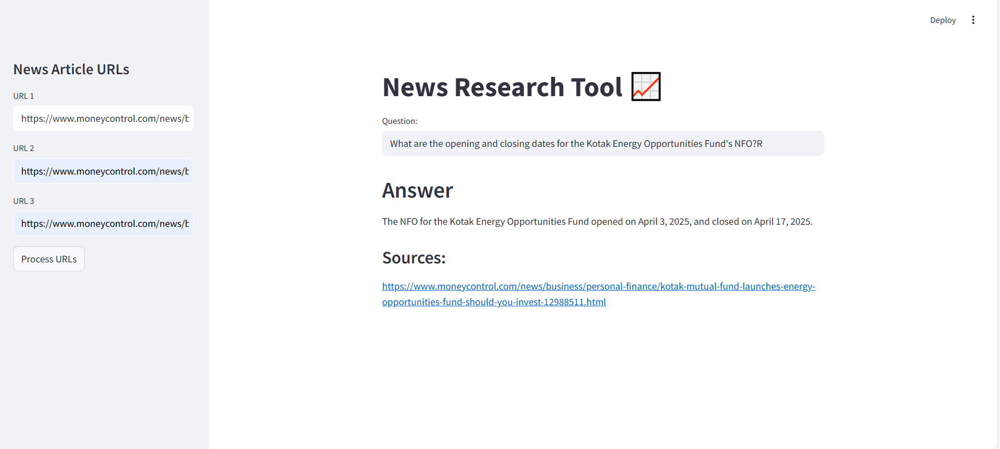

# 📰 News Research Tool

This project implements a web-based News Research Tool using Streamlit. Users can input up to three news article URLs, and the tool will extract, chunk, and embed their contents. It then allows users to ask questions, and the system returns relevant answers using a vector similarity search powered by FAISS.

---

## 🚀 Features

- Accepts up to 3 news article URLs
- Uses Langchain with FAISS for fast document retrieval
- Employs HuggingFace embeddings (`all-MiniLM-L6-v2`)
- Uses Google Generative AI or other LLMs for answering questions
- Fully interactive Streamlit interface

---

## 🧠 Tech Stack

- **Streamlit** - Web UI
- **Langchain** - QA and chaining logic
- **FAISS** - Vector similarity search
- **HuggingFace** - Embedding model
- **Google Generative AI / Custom LLM** - For answer generation
- **Pickle** - For saving vector store locally

---

## 📦 Installation Instructions

### 1. Clone the repository

```bash
git clone https://github.com/dishagopani05/LLM-Powered-News-Research-Tool
cd news-research-tool
```

### 2. Install dependencies

```bash
poetry install
```

### 3. Set your environment variable (optional, if using LLMs like Gemini)
Create a .env file in the root directory:

```env
GEMINI_API_KEY=your_api_key_here
```

### Run the App

```bash
streamlit run app.py
```
Open your browser and go to: `http://localhost:8501`

### Screenshots

